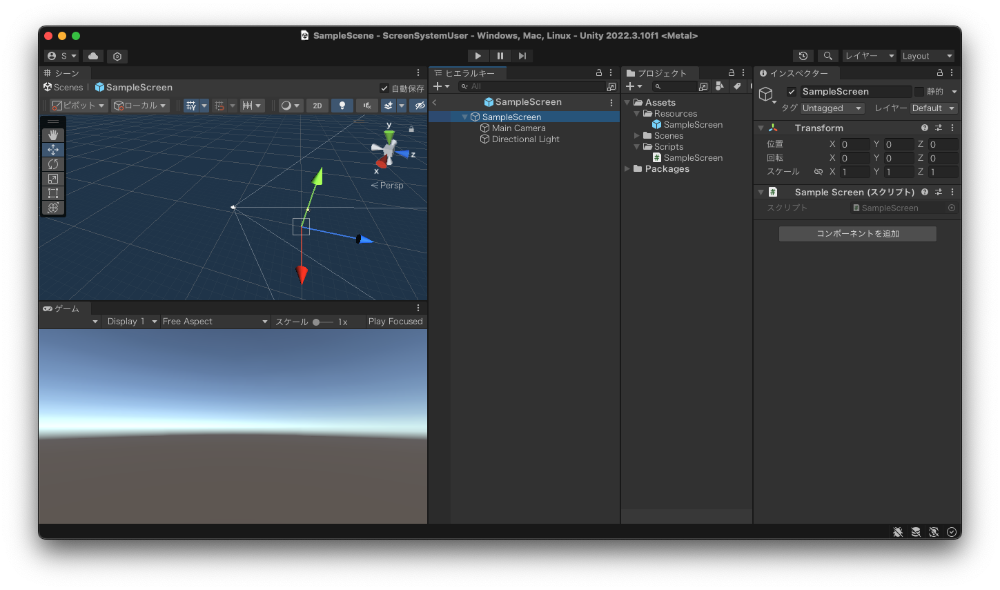

# ScreenSystem

## 概要

Unityでゲーム制作する際のシーン管理を支援するフレームワークです。
本フレームワークでは単一シーン構造を採用しており、以下の3点を重視しています。

- シーン間のデータの受け渡しをスムーズにしたい
- シーンを開く、閉じる際に処理を挟み込めるようにしたい
- シーンのトップモジュールを設定して親子関係を構築できるようにしたい

## セットアップ

### 依存ライブラリ

- [UniTask](https://github.com/Cysharp/UniTask)

### 導入

1. UniTaskを導入する
2. `PackageManager`の`Add package from git URL...` に以下を追加する。

```
https://github.com/sabanishi/ScreenSystem.git?path=/Packages/com.sabanishi.screensystem
```

## 使い方

詳しい使い方については、本レポジトリのサンプルコードをご覧ください。

### 各機能について

#### BaseScreen

- 本パッケージは単一シーン構造を想定しているため、シーンに相当するプレハブを用意する必要があります。
- そのプレハブには、**BaseScreen**を継承したスクリプトをアタッチする必要があります。
  - 下の画像は、BaseScreenを継承したSampleScreenを、「SampleScreen」という名前のプレハブにアタッチした状態です。



#### ScreenTransition

- 画面遷移を管理する機構です。
- このコンポーネントを使用する前に、初期化関数`Initialize()`を実行する必要があります。
  - この関数の引数は`Dictionary<Type,GameObject>`となっており、ゲームに使用するScreenの型とそのプレハブを紐づけたDictionaryを渡す必要があります。
- 画面遷移を行うための関数は**Move()**です。

#### ITransitionAnimation

- 画面を閉じる/開く際のアニメーションが実装すべきインターフェースです。
- `ScreenTransition#Move` の引数として渡します。

### 画面遷移の詳細

- `ScreenTransition#Move` の引数は以下の3つです。
  - 画面を閉じる際のアニメーション
  - 画面を開く際のアニメーション
  - 前の画面から次の画面に情報を渡すためのデリゲート
    - 上2つの型は`ITransitionAnimation`であり、デリゲートの型は`Action<BaseScreen>`です。

#### 画面遷移の流れ

画面Aから画面Bに遷移する時、以下の順に処理が実行されます。

1. 画面A.Close()
2. CloseAnimation
3. 画面A.Dispose()
4. Destroy(画面A)
5. Instantiate(画面B)
6. 画面B.Initialize()
7. 引数で渡されたデリゲートによるデータ受け渡し処理実行
8. OpenAnimation
9. 画面B.Open()

## ライセンス

MIT Lincense
