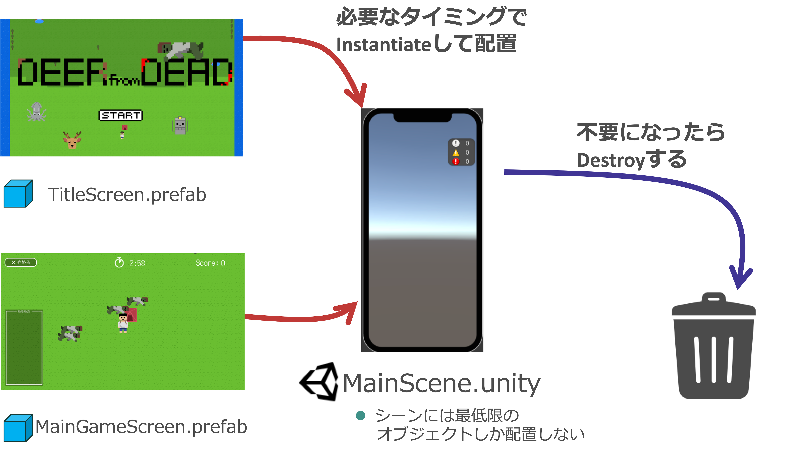
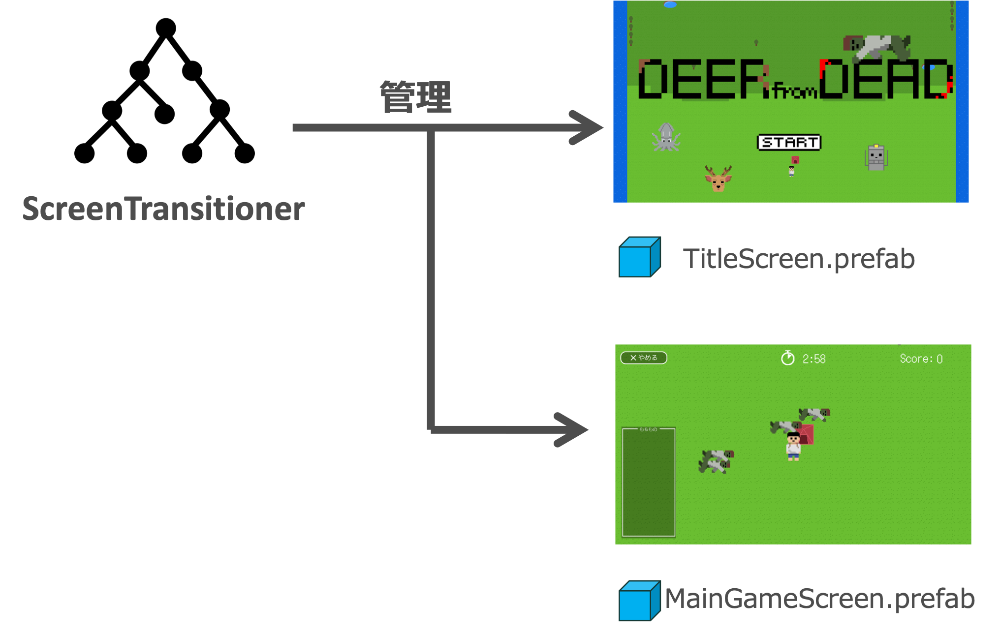
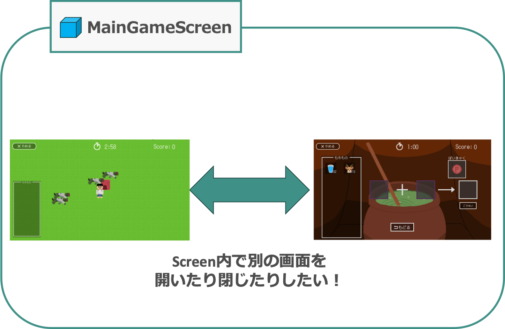
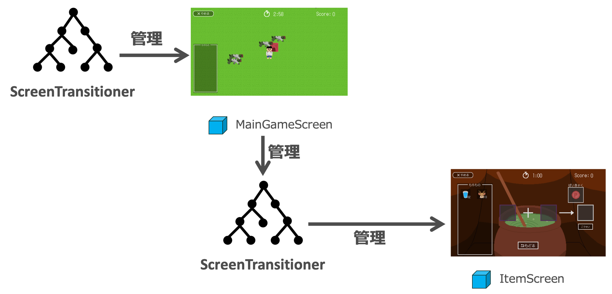
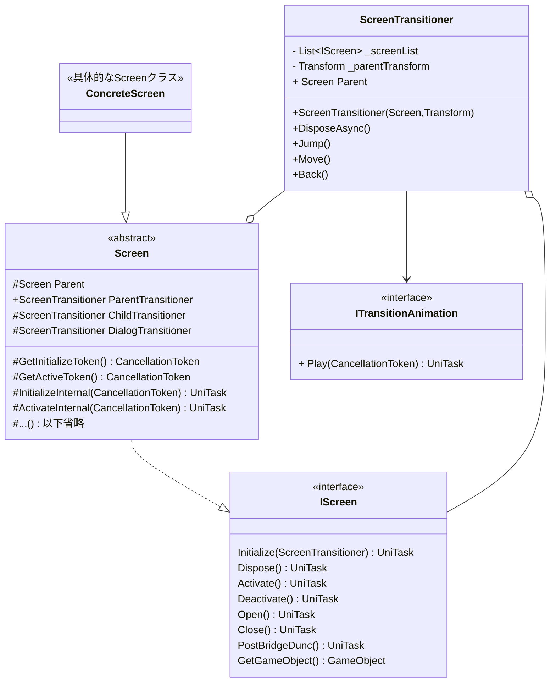

# ScreenSystem

## 概要

Unityでゲーム制作する際のシーン管理を支援するフレームワークです。
本フレームワークでは単一シーン構造を採用しており、以下の3点を重視しています。

- シーン間のデータの受け渡しをスムーズにしたい
- シーンを開く、閉じる際に処理を挟み込めるようにしたい
- シーンのトップモジュールを設定して親子関係を構築できるようにしたい

## セットアップ

### 依存ライブラリ

- [UniTask](https://github.com/Cysharp/UniTask)

### 導入

1. UniTaskを導入する
2. `PackageManager`の`Add package from git URL...` に以下を追加する。

```
https://github.com/sabanishi/ScreenSystem.git?path=/Packages/com.sabanishi.screensystem
```

## マニュアル

### 1. 単一シーン構造について

- 一般的なUnity開発において、画面毎にSceneを作成し、Scene自体を切り替えることで画面遷移を実現することが多いと思います。
  - この方法は仕組みがシンプルな一方で、Sceneを読み込むので**画面遷移処理が重い**、**前のシーンの情報(スコアなど)を次のシーンに受け渡しづらい**、**シーン初期化時などにイベントを差し込みにくい**といった欠点があります。
  - また、Sceneの中にSceneを配置できないため、**画面の階層構造**に対応しづらいです。

  

<br />

- そこで本フレームワークでは単一シーン構造を採用しています。
  - 画面をプレハブとして管理し、1つのScene内に動的にプレハブを生成/破棄することで画面遷移を実現しています。
  
  

### 2. ScreenとScreenTransitioner

- 画面の生成、破棄を管理するために、**Screen**、**ScreenTransitioner**という概念を導入します。
  - **Screen**は画面を構成するためのプレハブ(またはヒエラルキー上に配置したGameObject)です。上の例だとHomeScreen.prefabやMainGameScreen.prefabが該当します。
  - **ScreenTransitioner**は生成したScreenを管理するための機構です。

  

### 3. 階層構造を実現するための仕組み

- 前節で導入した概念により画面を管理する仕組みが実現できました。
- しかし、ScreenTransitonerが1つだと、Screenを入れ子にすることができないため、以下のようにScreen内での画面切り替えに対応できません。

  

- そのため、下記のようにScreenに別のScreenTransitionerインスタンスを持たせ、**親Screen**が**子Screen**を管理できるようにします。

  

### 4. 画面遷移を実現するための仕組み

- 前節までの仕組みにより、Screenオブジェクトを管理する仕組みが実装できました。この節では、**Screen間を移動する仕組み**を考えます。
- Screenの移動はScreenTransitionerのメソッドを使って行います。
- 移動用メソッドには3つの種類があります。
  - **Jump**: 遷移前のScreenを破棄して遷移します。後述するBackを行う必要がない時に使用します。
  - **Move**: 遷移前のScreenを残したまま遷移します。
  - **Back**: Move()メソッドを実行したScreenに戻ります。

### 5. 遷移用メソッドの詳細

#### 5.1. Triggerメソッド

- 前節で確認した処理により、画面遷移を行えるようになりました。では次に、「画面遷移中に処理を挟み込む」方法を考えます。

- Screenには、**画面遷移中に決まった順序で呼ばれるメソッド群**が用意されています。
  - Screenを継承した具象クラスでこれらをオーバーライドすることで、画面遷移中にメソッドを実行することができます。
  - 以下、このメソッド群を**Triggerメソッド**と呼びます。
- 以下のような**Triggerメソッド**が用意されています。

  ```csharp
  //Screenが生成された直後に呼ばれる
  UniTask Initialize();
  //Screenを破棄する直前に呼ばれる
  UniTask Dispose();
  //Screenを開く時に呼ばれる(暗転解除前)
  UniTask Activate();
  //Screenを閉じる時に呼ばれる(暗転後)
  UniTask Deactivate();
  //暗転解除前、bridgeAction(後述)後に呼ばれる
  UniTask PostBridgeFunc();
  //暗転解除後に呼ばれる
  UniTask Open();
  //暗転前に呼ばれる
  UniTask Close();
  ```

- 実際にオーバーライドする時は、Triggerメソッドを直接オーバーライドするのではなく、これらのメソッドが呼び出しているメソッドの方をオーバーライドします。

  ```csharp
  //こっちはオーバーライドしない
  public async UniTask Initialize(){
    ...
    await InitializeInternal();
    ...
  }
  //こっちをオーバーライドする
  protected virtual UniTask InitializeInternal(){}
  ```

#### 5.2. Screen間のデータの受け渡し

- Screen間でデータを受け渡すためには、Jump、Move、Backを実行する時に、「**遷移先のScreenを引数にとる関数**」をメソッドの引数に渡します。

  ```csharp
  var childTransitioner = new ScreenTransitioner();

  //遷移先のScreenを用意
  var to = GameObject.Instantiate<CharaDetailScreen>();
  //遷移先のScreenに渡すデータを用意
  var charaData = new CharaData();

  //遷移APIを実行する
  childTransitioner.Move<CharaDetailScreen>(to, bridgeAction: screen =>
  {
    //遷移先のScreenにデータを渡す
    //screenの型は「CharaDetailScreen」(Move<T>の「T」と同じ型)
    screen.ReceiveCharaData(charaData);
  }).Forget();
  ```

#### 5.3. 遷移アニメーション

- 画面遷移を行う際に、暗転などのアニメーションを挟み込みたい時があります。
- 本システムでは、**ITransitionAnimation**というインターフェースを継承したクラスを使用してアニメーションを再生します。

  ```csharp
  public interface ITransitionAnimation
  {
    public UniTask Play(CancellationToken token);
  }
  ```

- また、簡単な暗転アニメーションを行える**DefaultFadeAnimation**というクラスがシングルトンで提供されています。
- アニメーションを実行する方法は以下のように、遷移メソッドの引数に**ITransitionAnimation**を追加します。

    ```csharp
    var childTransitioner = new ScreenTransitioner();
    var to = GameObject.Instantiate<CharaDetailScreen>();
    
    //遷移時に再生するアニメーションを用意(今回はデフォルトの暗転を使用)
    var closeAnimation = DefaultFadeAnimation.Instance.CloseAnimation;
    var openAnimation = DefaultFadeAnimation.Instance.OpenAnimation;
    
    //遷移APIを実行する
    childTransitioner.Move<CharaEditScreen>(to,
      closeAnimation:closeAnimation,
      openAnimation:openAnimation).Forget();
    ```

#### 5.4. Triggerメソッドが呼ばれる順番

- Jump、Move、Backの内部では、それぞれ以下の順番でTriggerメソッドが実行されます。
  - 遷移前のScreenが**from**で、遷移後のScreenが**to**です。
  - **bridgeAction**は5.2で導入した関数、**closeAnimation・openAnimation**は5.3で導入したITransitionAnimationです。
- **Jump**

    ```csharp
    from.Close();
    closeAnimation.Play();
    from.Deactivate();
    from.gameobject.SetActive(false);
    from.Dispose();
    
    to.Initialize();
    to.gameobject.SetActive(true);
    to.Activate();
    bridgeAction(to);
    to.PostBridgeFunc();
    openAnimation.Play();
    to.Open();
    
    GameObject.Destroy(from.gameobject);
    ```

- **Move**

    ```csharp
    from.Close();
    closeAnimation.Play();
    from.Deactivate();
    from.gameobject.SetActive(false);
    
    to.Initialize();
    to.gameobject.SetActive(true);
    to.Activate();
    bridgeAction(to);
    to.PostBridgeFunc();
    openAnimation.Play();
    to.Open();
    ```

- **Back**

  ```csharp
  from.Close();
  closeAnimation.Play();
  from.Deactivate();
  from.gameobject.SetActive(false);
  from.Dispose();
  GameObject.Destroy(from.gameobject);

  //ここで戻るべきScreenを探す

  to.gameobject.SetActive(true);
  to.Activate();
  to.PostBridgeFunc();
  openAnimation.Play();
  to.Open();
  ```

### 6. 簡単なクラス関係



## ライセンス

MIT Lincense
